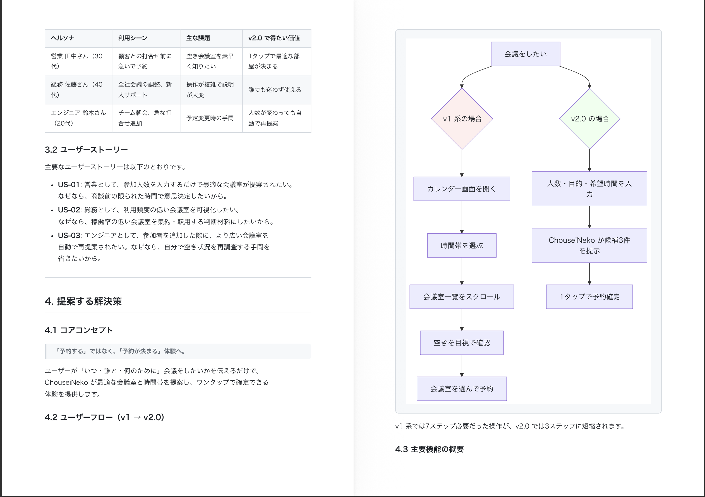
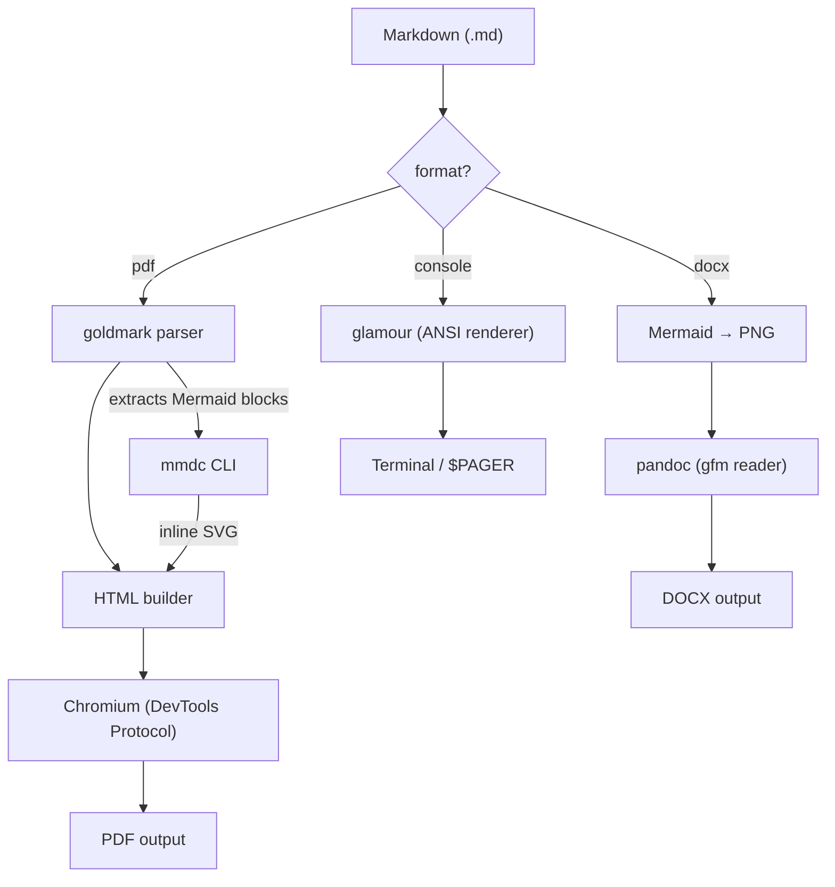
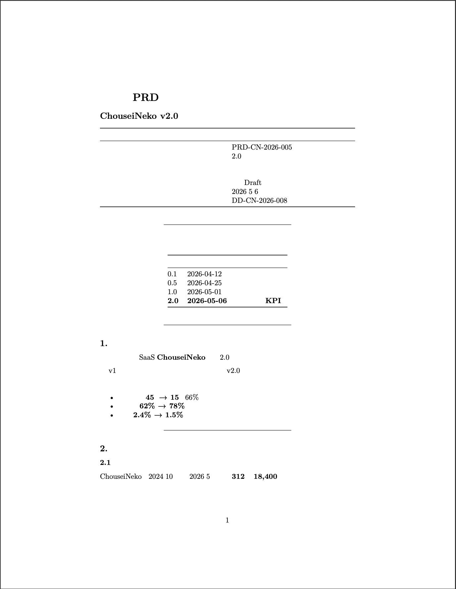
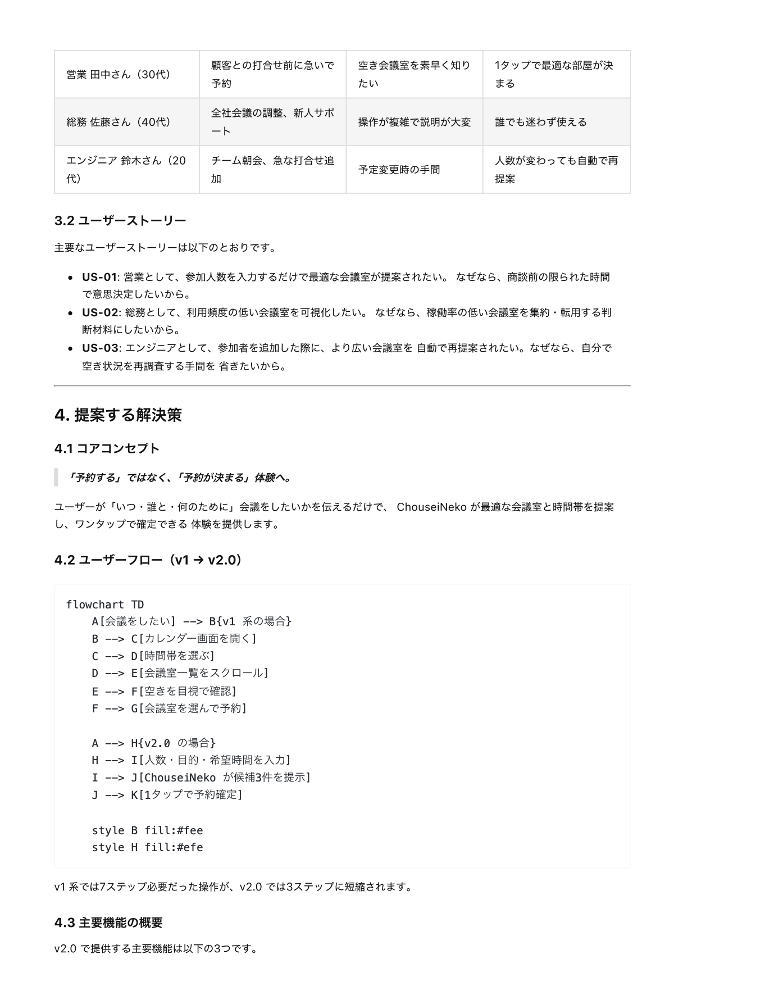

# md2pdf

> **Write in Markdown. Track in Git. Ship as PDF.**

md2pdf is a CLI for turning the technical Markdown you already write — design
docs, runbooks, security reports — into clean, deliverable PDFs (or Word/DOCX).
Mermaid diagrams render as inline SVG. Japanese (and other CJK) text renders
without font breakage. Single Go binary, drop-in for CI.

<p align="center">
  
  <br>
  <em>Output of <code>examples/06-japanese-document</code>: Japanese text and a colored Mermaid flowchart, both rendered cleanly.</em>
</p>

## Features

- 📐 **Mermaid diagrams as inline SVG** — vector-clean, no rasterization
- 🇯🇵 **Japanese / CJK text out of the box** — Noto Sans CJK JP preconfigured
- 📝 **GitHub-flavored Markdown** — tables, fenced code blocks, strikethrough
- 📃 **PDF or DOCX output** — `-format docx` exports editable Word documents (via pandoc)
- 👀 **Read it in the terminal** — `-format console` renders the document as styled, wrapped ANSI text and pages it through `less` (no conversion tools needed), drawing Mermaid flowcharts and sequence diagrams as inline images on kitty, iTerm2 and Sixel terminals and as box-drawing text art everywhere else
- 🤖 **CI-friendly single binary** — `go install` and you're done
- 📄 **Configurable** — page size, margins, fonts

## Quick Start

### 1. Install md2pdf

**Homebrew (macOS / Linux)** — recommended

```sh
brew install 135yshr/tap/md2pdf
```

This also installs [`mermaid-cli`](https://github.com/mermaid-js/mermaid-cli),
so diagrams work out of the box. Two things it **cannot** install, because a
Homebrew formula is not allowed to depend on a cask:

```sh
brew install --cask chromium              # needed for PDF and for Mermaid
brew install --cask font-noto-sans-cjk    # needed for Japanese text in PDF
```

Google Chrome counts as the browser; point md2pdf at any location with
`CHROME_PATH`. `-format console` needs neither.

`pandoc` is declared optional and is only needed for `-format docx` — either
`brew install pandoc`, or `brew install --with-pandoc 135yshr/tap/md2pdf`.

**Go install**

```sh
go install github.com/135yshr/md2pdf/cmd/md2pdf@latest
```

**Build from source**

```sh
git clone https://github.com/135yshr/md2pdf.git
cd md2pdf
go build -o md2pdf ./cmd/md2pdf
```

### 2. Install runtime dependencies

md2pdf uses external tools for diagram rendering and PDF generation. Install them after installing md2pdf:

```sh
# Mermaid CLI (diagram rendering)
npm install -g @mermaid-js/mermaid-cli

# A Chromium (PDF generation)
brew install --cask chromium        # macOS; Google Chrome also works
sudo apt install -y chromium        # Debian/Ubuntu

# pandoc — only needed for DOCX output (-format docx)
brew install pandoc          # macOS / Linux (Homebrew)
# sudo apt install pandoc    # Ubuntu / Debian
```

### 3. Install fonts (optional)

For Japanese text support, install the Noto Sans CJK JP font:

**macOS**
```sh
brew install font-noto-sans-cjk
```

**Ubuntu / Debian**
```sh
sudo apt install fonts-noto-cjk
```

### 4. Convert your first document

```sh
md2pdf document.md
```

A `document.pdf` file will be generated in the same directory. To export Word
instead, run `md2pdf -format docx document.md`.

## Requirements Summary

Installed for you by `brew install 135yshr/tap/md2pdf`:

| Dependency | Purpose | Install |
|---|---|---|
| [mmdc](https://github.com/mermaid-js/mermaid-cli) | Mermaid → SVG/PNG | `brew install mermaid-cli`, or `npm install -g @mermaid-js/mermaid-cli` |
| A Chromium browser | HTML → PDF | `brew install --cask chromium` / `apt install chromium` (Google Chrome also works; override with `CHROME_PATH`) |
| [pandoc](https://pandoc.org/) | Markdown → DOCX (only for `-format docx`) | `brew install pandoc` / `apt install pandoc` |
| Noto Sans CJK | Japanese font (optional) | `brew install --cask font-noto-sans-cjk` / `apt install fonts-noto-cjk` |
| Go 1.26+ | Build from source only | https://go.dev |

`-format console` needs none of these — it renders in-process and only uses a pager if one is installed.

**Check your machine with `-doctor`**, which reports what is present and which
formats can run, without converting anything:

```
$ md2pdf -doctor
Chromium       ok       /Applications/Google Chrome.app/Contents/MacOS/Google Chrome
                        printing PDFs, and rendering Mermaid diagrams via mmdc
mmdc           missing  brew install mermaid-cli, or npm install -g @mermaid-js/mermaid-cli
                        Mermaid diagrams in pdf, html and docx output — only needed for documents containing Mermaid diagrams
pandoc         missing  brew install pandoc, or apt install pandoc
                        -format docx
Noto CJK font  missing  brew install --cask font-noto-sans-cjk, or apt install fonts-noto-cjk
                        Japanese text in pdf and html output — output still works without it

pdf      ready
html     ready
docx     not ready (needs pandoc)
console  ready
```

It exits non-zero when a format is blocked, so it works as a check in a setup
script. Note what it does **not** claim: a missing `mmdc` leaves `pdf` ready,
because a document with no Mermaid blocks converts without it.

**Why the browser and the font are not installed by Homebrew.** Both are casks,
and a formula cannot depend on a cask: Homebrew's formula DSL has no `cask:`
dependency at all, while the cask DSL accepts both `formula:` and `cask:`. So
`brew install 135yshr/tap/md2pdf` brings `mermaid-cli` (and `pandoc` if you ask
for it) and stops there.

Note also that `brew install mermaid-cli` does **not** bring a browser of its
own — Homebrew's own formula test asserts that `mmdc` fails with
`Could not find chrome-headless-shell`. md2pdf works because it hands `mmdc` the
browser it resolved itself, which is the same one it uses to print the PDF.

## Usage

```sh
md2pdf [options] <input.md>
```

### Options

| Flag | Default | Description |
|---|---|---|
| `-o <path>` | `<input>.pdf` | Output path (`.docx` extension implies `-format docx`; not allowed with `-format console`; **required when reading from stdin** for `pdf`/`docx`) |
| `-format <fmt>` | `pdf` | Output format: `pdf`, `html`, `docx`, or `console` (aliases `term`, `terminal`; inferred from `-o` extension when omitted, including `.html`/`.htm`) |
| `-doctor` | — | Report which runtime dependencies are present and which formats can run, then exit |
| `-css <path>` | — | Custom CSS applied after the built-in stylesheet, so its rules win. Repeatable; later files override earlier ones. Used by `pdf` and `html` |
| `-font <path>` | auto-detected | Noto Sans CJK JP Regular font |
| `-font-bold <path>` | auto-detected | Noto Sans CJK JP Bold font |
| `-font-medium <path>` | auto-detected | Noto Sans CJK JP Medium font |
| `-mmdc <path>` | auto-detected | Path to `mmdc` binary |
| `-pandoc <path>` | auto-detected | Path to `pandoc` binary (used for `-format docx`) |
| `-docx-font <family>` | `Yu Gothic` | Font family for DOCX output (Latin + East Asian) |
| `-puppeteer-config <f>` | auto-generated | Puppeteer JSON config for mmdc |
| `-page-size <size>` | `A4` | `A4`, `Letter`, or `A3` |
| `-margin-top <m>` | `18mm` | Top margin |
| `-margin-bottom <m>` | `18mm` | Bottom margin |
| `-margin-left <m>` | `14mm` | Left margin |
| `-margin-right <m>` | `14mm` | Right margin |
| `-width <cols>` | terminal width | Console word-wrap width, capped at 120 columns (`-format console`) |
| `-style <name\|path>` | `auto` | Console theme: `auto`, `dark`, `light`, `notty`, `ascii`, `dracula`, `pink`, `tokyo-night`, or a JSON stylesheet path (env: `GLAMOUR_STYLE`) |
| `-pager` | true | Page console output through `$PAGER` (default `less -R -F`); `-pager=false` writes straight to stdout |
| `-mermaid-render <mode>` | `auto` | How Mermaid blocks are drawn in console output: `auto`, `image`, `ascii` or `source` (`-format console`) |
| `-v` | false | Verbose output (progress logs go to stderr) |
| `-version` | — | Print version and exit |

### Examples

```sh
# Basic conversion
md2pdf document.md

# Custom output path
md2pdf -o report.pdf document.md

# Export to Word (DOCX)
md2pdf -format docx document.md
md2pdf -o report.docx document.md   # format inferred from extension

# Read the document in the terminal
md2pdf -format html document.md                              # stop at HTML, no Chromium
md2pdf -format html -css brand.css document.md               # iterate on CSS in a browser
md2pdf -css brand.css -css client.css -o report.pdf document.md
md2pdf -format console document.md
md2pdf -format console -style dark -width 100 document.md
md2pdf -format console -pager=false document.md | cat   # plain text, no color
md2pdf -format console -mermaid-render image document.md   # require inline diagrams
md2pdf -format console -mermaid-render ascii document.md   # always draw text art
md2pdf -format console -mermaid-render source document.md  # always show Mermaid source

cat doc.md | md2pdf -format console -                       # read from stdin
gh pr view 41 --json body -q .body | md2pdf -o pr.pdf -     # pipe into a PDF
md2pdf -format console docs/*.md                            # several files at once

# Explicit font path
md2pdf -font /usr/share/fonts/opentype/noto/NotoSansCJK-Regular.ttc document.md

# Letter size with wider margins
md2pdf -page-size Letter -margin-left 20mm -margin-right 20mm document.md

# Verbose output
md2pdf -v document.md
```

## Who is this for?

- Engineers writing design docs, runbooks, or technical specs in Markdown
- Teams using Mermaid diagrams (flowcharts, sequence diagrams) in their documents
- Consultants and security teams delivering reports as PDFs to clients
- Japanese-speaking developers tired of fighting font breakage in Markdown-to-PDF tools
- Anyone who manages docs in Git and needs to ship them as PDF artifacts

## How It Works



Each format reads from the source that renders best for it.

- **PDF** (default) — goldmark converts Markdown to HTML (GFM tables, fenced code blocks), Mermaid blocks are rendered to inline SVG via `mmdc`, a self-contained HTML file is assembled with GitHub-flavored CSS and `@font-face` declarations for Noto Sans CJK JP, and a headless Chromium browser, driven directly over the DevTools Protocol, prints it to PDF. No Python or Playwright is involved — the same browser also serves `mmdc`, so one Chromium covers both stages.
- **Console** — the Markdown is rendered to styled ANSI text by [glamour](https://github.com/charmbracelet/glamour) (the library behind [glow](https://github.com/charmbracelet/glow)), wrapped to the terminal width and paged through `$PAGER`. The theme follows the terminal background unless `-style` says otherwise; color is dropped entirely when `NO_COLOR` is set or the output is piped. Mermaid blocks are drawn as inline images when the terminal supports one of the image protocols below, as box-drawing text art when it does not, and otherwise stay visible as their source — so console output still needs no conversion tools of its own.
- **DOCX** — the Markdown is sent **directly to `pandoc`** (its `gfm` reader, no HTML in between), so pandoc produces clean, Word-native paragraph and list styles. Mermaid blocks are rasterised to PNG and spliced back in as image references (Word cannot reliably display pandoc-embedded SVG). A generated reference document gives the output a readable, Japanese-friendly look: a 10.5pt body, compact blue headings, bordered GFM tables, and the `Yu Gothic` font (override with `-docx-font`).

### Custom CSS and HTML output

**Custom CSS.** `-css` injects a stylesheet **after** the built-in
GitHub-flavored CSS, in the same inline `<style>` block, so your rules win the
cascade:

```sh
md2pdf -css brand.css document.md
```

It is repeatable, and later files override earlier ones — useful for a shared
house style plus a per-client override:

```sh
md2pdf -css house.css -css client-acme.css -o acme.pdf document.md
```

Precedence is: built-in stylesheet → first `-css` → … → last `-css`.

A stylesheet containing `</style` is rejected, since it would close the inline
block the CSS is embedded in. A missing `-css` file fails immediately, naming it.

`-css` applies to `pdf` and `html`. DOCX styling goes through pandoc's reference
document instead (see `-docx-font`), and console output is styled by `-style`.

**HTML output.** `-format html` stops the pipeline after the HTML is assembled
and writes that file, so **Chromium is never started**:

```sh
md2pdf -format html document.md          # -> document.html
md2pdf -o page.html document.md          # .html/.htm also infers the format
```

This is the fast way to iterate on custom CSS — reload in a browser instead of
re-rendering a PDF each time — and it is useful on its own for publishing to a
static site.

The HTML is self-contained in the same sense the PDF pipeline needs: the
stylesheet is inlined and Mermaid diagrams are embedded as inline SVG.
**Image paths are left exactly as written in the Markdown**, so they resolve
relative to the HTML file. That works for the default output location beside the
input; if you send the HTML elsewhere with `-o`, copy the images along with it.

### Inputs

A single `.md` path works for every format. Two extras relax that:

**Standard input.** `-` reads the document from standard input instead of a file:

```sh
cat doc.md | md2pdf -format console -
gh issue view 30 --json body -q .body | md2pdf -o issue.pdf -
```

- Relative paths inside the document (images, resources) resolve against the
  **current directory**, since a piped document has no location of its own.
- `-o` is **required** for `pdf` and `docx`, because there is no input filename
  to derive the output name from.
- Empty **standard input** is an error, not an empty document: an empty pipe
  almost always means the command upstream produced nothing, and failing loudly
  makes the pipeline fail too. Whitespace-only counts as empty. An empty *file*
  is unaffected and still renders an empty document, as it always has.
- Passing `-` when standard input is a terminal fails immediately rather than
  waiting silently for something to be typed.

**Several files, console only.** Multiple paths render in order, separated by a
rule:

```sh
md2pdf -format console docs/*.md
md2pdf -format console intro.md guide.md appendix.md
```

- Only `-format console` accepts more than one path. Merging documents into one
  PDF or DOCX would need decisions about heading level shifts, page breaks and
  per-file image bases, so `pdf` and `docx` keep the single-document contract
  and say so explicitly.
- Every path is checked before anything is rendered, so a typo in the third of
  three files fails immediately and names that file.
- Repeats are kept: the same file passed twice renders twice.
- `-` cannot be combined with file paths.

The separator is glamour's own horizontal rule, so it follows the theme — dimmed
under a dark style, plain ASCII under `-style ascii`, colorless under
`NO_COLOR` — and looks like a `---` written in the document itself.

### Mermaid diagrams in the terminal

With `-format console`, Mermaid blocks are drawn as diagrams rather than printed
as source. md2pdf walks a fallback chain and `-mermaid-render` picks where to
start. Anything the chain cannot draw — a diagram type without a text-art
renderer, or a block that fails to parse — keeps its Mermaid source, so no
document ever loses content:

| Mode | Behaviour |
| --- | --- |
| `auto` (default) | Inline image → text art → Mermaid source, taking the first that works |
| `image` | Require an inline image. A terminal that cannot show one, a missing `mmdc`, or a diagram that fails to rasterise are all errors rather than a quiet downgrade |
| `ascii` | Always draw box-drawing text art (source only for diagram types it cannot draw) |
| `source` | Always print the Mermaid source as a code block |

**Step 1 — inline images.** Used when the terminal supports an image protocol,
the output is an interactive terminal, `NO_COLOR` is unset, and `mmdc` is
installed. Protocols are detected from `TERM` and `TERM_PROGRAM`:

| Protocol | Terminals |
| --- | --- |
| kitty graphics | kitty, Ghostty (`TERM=xterm-kitty`, `TERM=xterm-ghostty`, `KITTY_WINDOW_ID`) |
| iTerm2 inline images | iTerm2, WezTerm (`TERM_PROGRAM=iTerm.app`, `TERM_PROGRAM=WezTerm`) |
| Sixel | foot, mlterm, yaft, and any `TERM` containing `sixel` |

**Step 2 — box-drawing text art.** Rendered in-process by
[mermaid-ascii](https://github.com/AlexanderGrooff/mermaid-ascii), so it needs no
external tool and works on any terminal, when piped, and under the pager:

```
┌─────────────┐          ┌─────────────┐
│             │          │             │
│ Client Apps ├─1─Login─►│ API Gateway │
│             │          │             │
└─────────────┘          └─────────────┘
```

Only `flowchart` / `graph` and `sequenceDiagram` are drawn as text art. Every
other diagram type — `gantt`, `pie`, `erDiagram`, `stateDiagram`, `classDiagram`
and the rest — keeps its Mermaid source. (`erDiagram` is excluded deliberately:
the library parses it but lays the entities out misaligned.)

**Step 3 — Mermaid source**, exactly as v0.7.0 printed it.

Notes:

- `-style ascii`, or `GLAMOUR_STYLE=ascii`, draws the art with plain `+`, `-`
  and `|` instead of Unicode box-drawing characters.
- Text art wider than the wrap width is clipped to it, keeping the diagram's
  shape rather than letting the terminal fold lines into fragments.
- Inline images **bypass the pager**: neither the kitty nor the iTerm2 sequences
  survive a trip through `less`. Text art pages normally, so
  `-mermaid-render ascii` is the way to page a long document and still see
  diagrams.
- Images are never written when the output is piped or redirected, or when
  `NO_COLOR` is set; those cases fall through to text art, which is plain text.
  With `-mermaid-render image` they are an error instead.
- A Mermaid block carrying a YAML frontmatter title block is handled normally;
  the title is printed above the diagram, as Mermaid does.
- Sixel detection is environment-based, because querying the terminal directly
  would require putting it into raw mode and waiting for a reply. A Sixel
  terminal that sets none of the markers above is therefore not detected and
  gets text art instead; `-mermaid-render image` reports the missing capability
  rather than forcing a protocol.

## Comparison with other tools

Pandoc, md-to-pdf, and other Markdown-to-PDF tools are powerful and flexible.
md2pdf focuses on a narrower use case: turning **technical Markdown with
Mermaid diagrams and Japanese (CJK) text into clean PDFs with minimal setup**.

The screenshots below show what happens when you convert the same Japanese
PRD document (`examples/06-japanese-document/input.md`) with each tool out of
the box.

<table>
<tr>
<td align="center" width="33%">
<b>Pandoc</b> (with <code>xelatex</code>)<br>

</td>
<td align="center" width="33%">
<b>md-to-pdf</b><br>

</td>
<td align="center" width="33%">
<b>md2pdf</b><br>

</td>
</tr>
<tr>
<td valign="top">Japanese characters are missing because no CJK font is configured.</td>
<td valign="top">Japanese is fine, but Mermaid blocks remain as raw source code.</td>
<td valign="top">Japanese renders correctly <b>and</b> Mermaid is embedded as inline SVG.</td>
</tr>
</table>

These are not bugs in Pandoc or md-to-pdf — both can produce great results
once you configure CJK fonts and Mermaid plugins. md2pdf is just preconfigured
for this exact combination, so it works without any extra setup.

## Troubleshooting

### No Chromium executable found

md2pdf drives a headless Chromium to print the PDF, and `mmdc` needs one to
render diagrams. Both use the same browser, located in this order:

1. `CHROME_PATH`, if set
2. common Linux paths (`/usr/bin/chromium`, `/usr/bin/google-chrome`, …)
3. a Playwright browser cache, if one happens to exist
4. `/Applications/Google Chrome.app` and `/Applications/Chromium.app` on macOS

If none is found, point md2pdf at the browser you have:

```sh
export CHROME_PATH="/Applications/Google Chrome.app/Contents/MacOS/Google Chrome"
```

Console output needs no browser at all, so `-format console` keeps working.

## Running Tests

```sh
# Every test. The integration test skips itself when its tools are absent.
go test ./...

# Require the integration toolchain (mmdc + a Chromium): a missing tool
# now fails instead of skipping.
MD2PDF_REQUIRE_INTEGRATION=1 go test ./...

# With verbose output
go test -v ./...
```

## Contributing

Contributions are welcome! Please read [CONTRIBUTING.md](CONTRIBUTING.md) before opening a pull request.

## License

MIT License — see [LICENSE](LICENSE).
