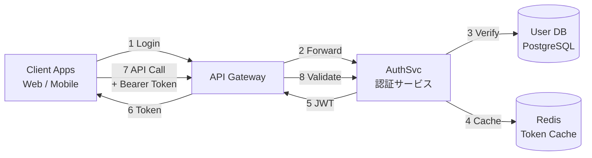
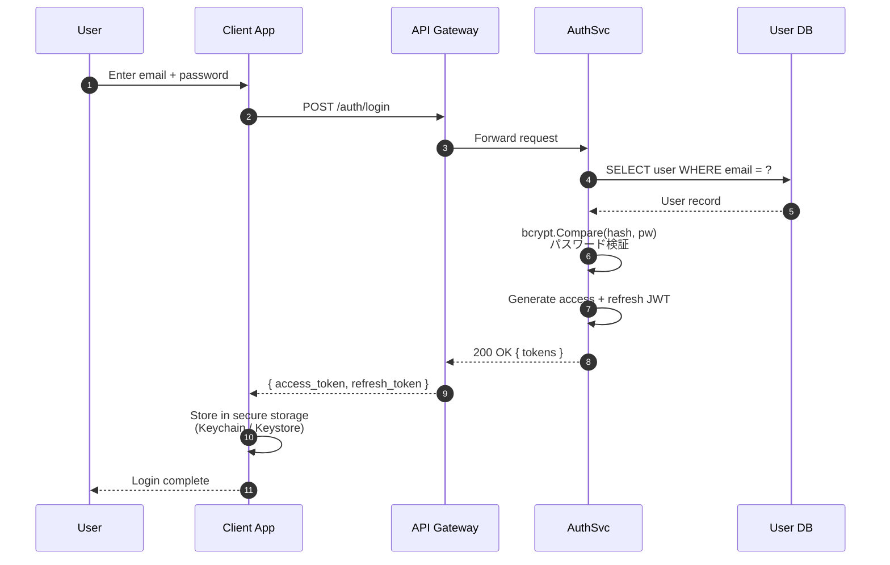
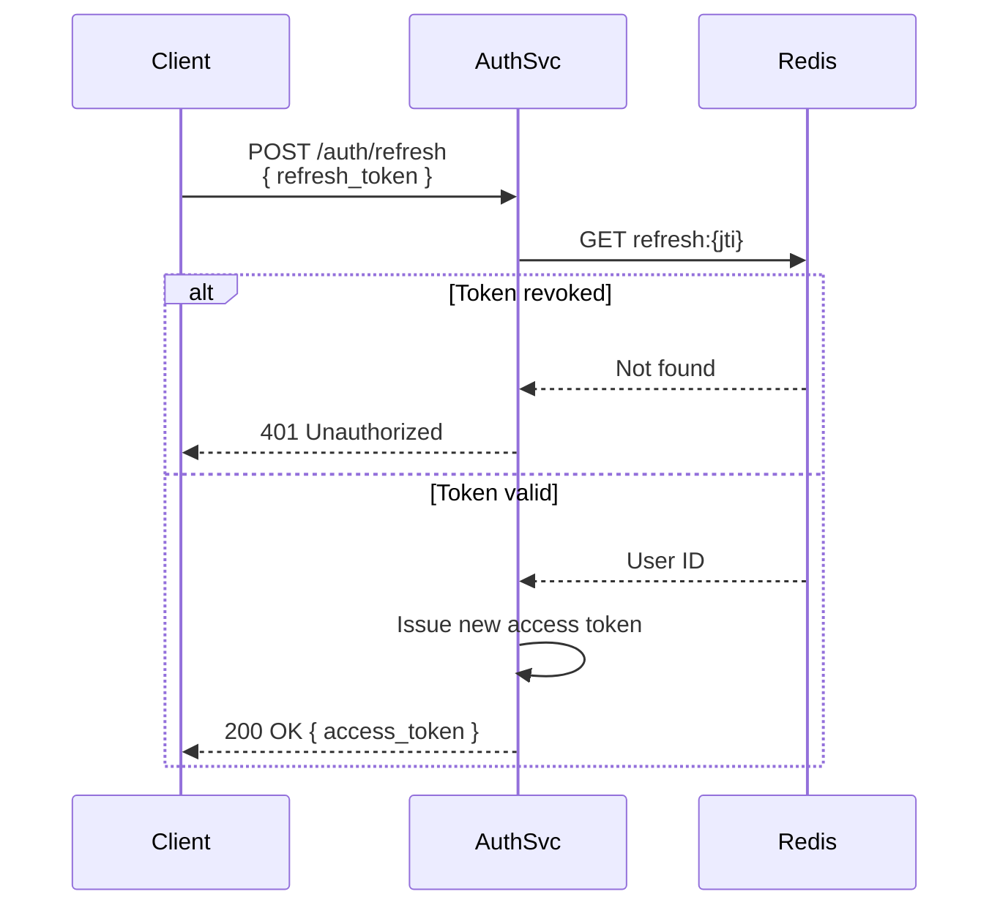
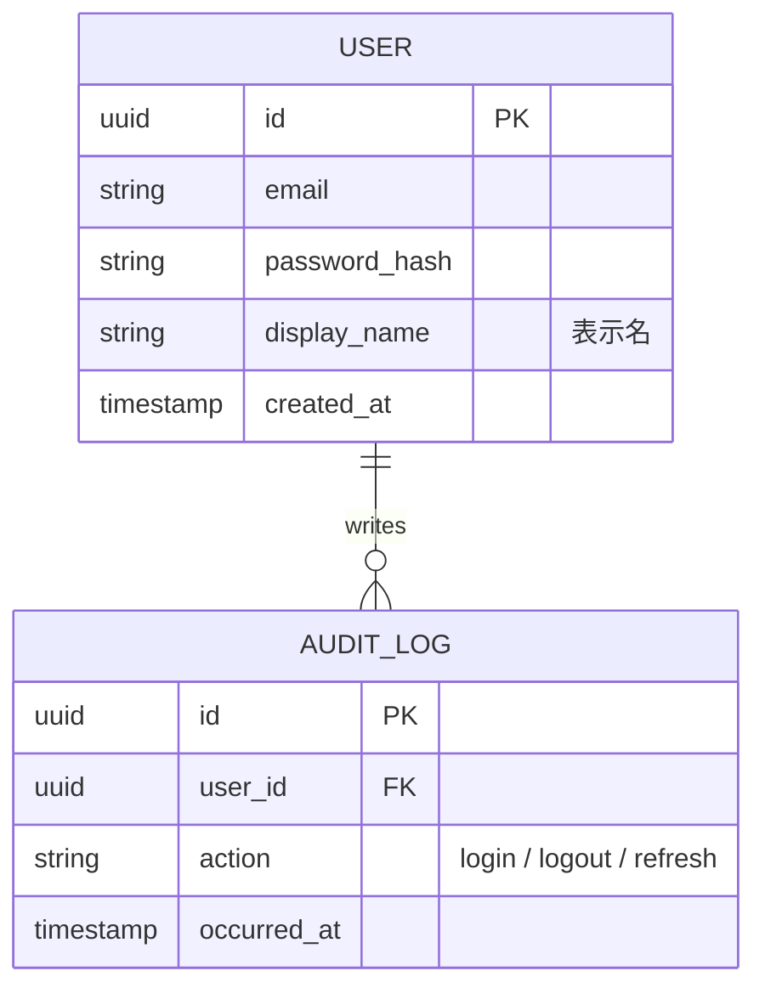

# User Authentication Service — Detailed Design Document

| Field | Value |
|---|---|
| Document ID | DD-AUTH-2026-001 |
| Version | 1.2.0 |
| Author | Platform Team |
| Reviewers | Tanaka (Tech Lead), Sato (Security) |
| Last Updated | 2026-05-06 |
| Status | Draft (レビュー中) |

---

## 1. Overview

This document describes the detailed design of the **User Authentication
Service** (略称: AuthSvc), a stateless service that issues and validates
JSON Web Tokens (JWT) for the platform.

It is intended for backend engineers, SREs, and security reviewers. Reading
this document assumes familiarity with OAuth 2.0 (RFC 6749) and JWT
(RFC 7519).

### 1.1 Purpose

The AuthSvc replaces the legacy session-cookie-based authentication
(`/auth/legacy/*`) with a stateless token-based mechanism. The migration
target is **2026年9月末** (end of September 2026).

### 1.2 Scope

**In scope**

- Issuing access tokens and refresh tokens
- Validating tokens at the API gateway
- Revoking tokens (logout, password reset)
- Rate limiting for authentication endpoints

**Out of scope**

- Single Sign-On (SSO) — covered by `DD-SSO-2026-002`
- Multi-Factor Authentication (MFA) — phase 2 (2026 Q4)
- Identity federation with external IdPs — phase 3

### 1.3 Stakeholders

| Role | Name | Responsibility |
|---|---|---|
| Product Owner | 山田 太郎 | Requirements approval |
| Tech Lead | 田中 健一 | Architecture review |
| Security Lead | 佐藤 美咲 | Security review |
| SRE | 鈴木 大輔 | Production rollout |

---

## 2. Architecture

### 2.1 System Components



### 2.2 Technology Stack

| Layer | Technology | Version |
|---|---|---|
| Language | Go | 1.22+ |
| Framework | chi router | v5 |
| Database | PostgreSQL | 16 |
| Cache | Redis | 7 |
| JWT Library | `github.com/golang-jwt/jwt/v5` | v5.2 |
| Password Hash | `golang.org/x/crypto/bcrypt` | latest |
| Container | Docker / Kubernetes | — |

> **Note**: bcrypt cost factor は本番環境で `12` に設定すること。
> ステージングは `10` で許容（CI を遅くしないため）。

---

## 3. Authentication Flow

### 3.1 Login Sequence

The login flow follows the OAuth 2.0 Resource Owner Password Credentials
grant (RFC 6749 §4.3) for first-party clients only.



### 3.2 Token Refresh

When the access token expires (default lifetime: **15 minutes**), the
client uses the refresh token (lifetime: **30 days**) to obtain a new
access token without requiring the user to re-authenticate.



### 3.3 Session Management

Refresh tokens are stored in Redis with the JTI (JWT ID) as the key. On
logout, the JTI is removed, invalidating the refresh token immediately.

> 田中（Tech Lead）: **「ログアウト時にアクセストークンも無効化したい」**
> という要件は phase 2 で検討。現状はアクセストークンの短い lifetime
> （15分）でリスクを抑える設計とする。

---

## 4. Data Model

### 4.1 User Table

```sql
CREATE TABLE users (
    id            UUID PRIMARY KEY DEFAULT gen_random_uuid(),
    email         VARCHAR(255) NOT NULL UNIQUE,
    password_hash VARCHAR(60)  NOT NULL,         -- bcrypt fixed length
    display_name  VARCHAR(100),                  -- 表示名 (任意)
    locale        VARCHAR(10)  DEFAULT 'en-US',  -- 'ja-JP' など
    created_at    TIMESTAMPTZ  NOT NULL DEFAULT now(),
    updated_at    TIMESTAMPTZ  NOT NULL DEFAULT now(),
    deleted_at    TIMESTAMPTZ                    -- soft delete
);

CREATE INDEX idx_users_email ON users (email) WHERE deleted_at IS NULL;
```

### 4.2 Session Table

Sessions are kept in Redis only — no relational table is required.
Schema (Redis hash):

| Key | Field | Type | Description |
|---|---|---|---|
| `refresh:{jti}` | `user_id` | UUID | Owner of the token |
| `refresh:{jti}` | `issued_at` | int64 | Unix timestamp |
| `refresh:{jti}` | `client_id` | string | Originating client app |
| `refresh:{jti}` | TTL | — | 30 days (2,592,000 seconds) |

### 4.3 Entity Relationship



---

## 5. API Specification

### 5.1 POST /auth/login

Authenticate a user and issue tokens.

**Request**

```json
{
  "email": "yamada@example.com",
  "password": "S3cure!Pass2026"
}
```

**Response (200 OK)**

```json
{
  "access_token": "eyJhbGciOi...",
  "refresh_token": "eyJhbGciOi...",
  "token_type": "Bearer",
  "expires_in": 900
}
```

### 5.2 POST /auth/refresh

Exchange a refresh token for a new access token.

**Request**

```http
POST /auth/refresh HTTP/1.1
Authorization: Bearer eyJhbGciOi...   # refresh token
```

### 5.3 Error Codes

| HTTP | Code | Meaning | 日本語 |
|---|---|---|---|
| 400 | `invalid_request` | Missing required field | リクエスト不正 |
| 401 | `invalid_credentials` | Wrong email or password | 認証情報が誤り |
| 401 | `token_expired` | Access token expired | トークン期限切れ |
| 401 | `token_revoked` | Refresh token revoked | トークン無効化済み |
| 429 | `rate_limited` | Too many login attempts | レート制限超過 |
| 500 | `internal_error` | Unexpected server error | サーバー内部エラー |

---

## 6. Security Considerations

### 6.1 Password Storage

- Passwords are hashed with **bcrypt (cost = 12)** before storage.
- Plaintext passwords MUST NOT appear in application logs.
- パスワードリセット時は古い hash を破棄し、再生成する。

### 6.2 Token Lifetime

| Token | Default Lifetime | Rationale |
|---|---|---|
| Access | 15 min | Short window limits stolen-token impact |
| Refresh | 30 days | Balances UX (re-login frequency) and security |

> 佐藤（Security）: **アクセストークンを15分より短くするとAPI負荷
> が無視できないため15分で合意。リフレッシュトークンは30日が業界標準。**

### 6.3 Rate Limiting

The `/auth/login` endpoint enforces the following limits per IP:

- **5 attempts** per 60 seconds → soft block (HTTP 429)
- **20 attempts** per 1 hour → hard block (1 hour cooldown)

> **注意**: ログイン失敗回数を **emailキー**でも数えること。同一アカウント
> への分散IP攻撃を防ぐため。

---

## 7. Implementation Notes

### 7.1 JWT Validation Middleware (Go)

```go
// AuthMiddleware validates the Bearer token on incoming requests.
// 認証ミドルウェア — すべての保護されたエンドポイントで使用する。
func AuthMiddleware(verifier TokenVerifier) func(http.Handler) http.Handler {
    return func(next http.Handler) http.Handler {
        return http.HandlerFunc(func(w http.ResponseWriter, r *http.Request) {
            raw := extractBearer(r.Header.Get("Authorization"))
            if raw == "" {
                writeError(w, http.StatusUnauthorized, "missing_token")
                return
            }

            claims, err := verifier.Verify(r.Context(), raw)
            if err != nil {
                // 検証失敗 — クライアントには詳細を漏らさない
                writeError(w, http.StatusUnauthorized, "invalid_token")
                return
            }

            ctx := context.WithValue(r.Context(), userIDKey, claims.Subject)
            next.ServeHTTP(w, r.WithContext(ctx))
        })
    }
}
```

### 7.2 Configuration

Environment variables consumed by AuthSvc:

```sh
AUTH_JWT_PRIVATE_KEY_PATH=/etc/authsvc/private.pem
AUTH_JWT_PUBLIC_KEY_PATH=/etc/authsvc/public.pem
AUTH_ACCESS_TOKEN_TTL=15m
AUTH_REFRESH_TOKEN_TTL=720h           # 30 days
AUTH_BCRYPT_COST=12
AUTH_REDIS_URL=redis://redis:6379/0
AUTH_DB_DSN=postgres://...
```

---

## 8. Open Questions

The following items require decision before GA release.

> **Q1 (田中)**: アクセストークンに `roles` クレームを含めるか、
> 別エンドポイントで取得するか?
>
> Pros of inclusion — single round-trip; Pros of separate endpoint —
> fewer revalidation issues when roles change.

> **Q2 (佐藤)**: Refresh token rotation を導入するか?
>
> 業界では推奨されているが、実装複雑度が上がる。phase 1 では見送り、
> phase 2 で再評価する案を提示中。

> **Q3 (鈴木)**: 本番ロールアウトは段階リリース (10% → 50% → 100%) で
> 行う前提でよいか? feature flag は LaunchDarkly を使用する想定。

---

## 9. References

- RFC 6749 — The OAuth 2.0 Authorization Framework
- RFC 7519 — JSON Web Token (JWT)
- RFC 8725 — JSON Web Token Best Current Practices
- 社内ドキュメント: `Platform Security Standard v3.2 (2026-04)`
- 過去設計: `DD-AUTH-LEGACY-2023-014` (replaced by this document)

---

*This document is part of the md2pdf example collection. It demonstrates
mixed English / Japanese technical writing, Mermaid diagrams (flowchart,
sequence, ER), tables, code blocks (Go / SQL / JSON / shell), and
GitHub-flavored Markdown.*
