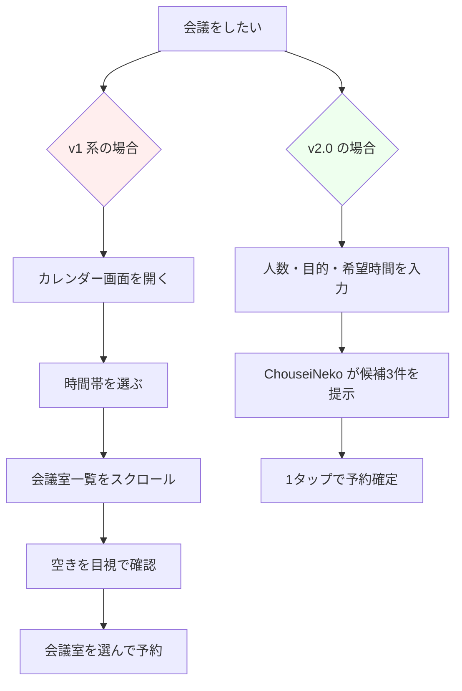
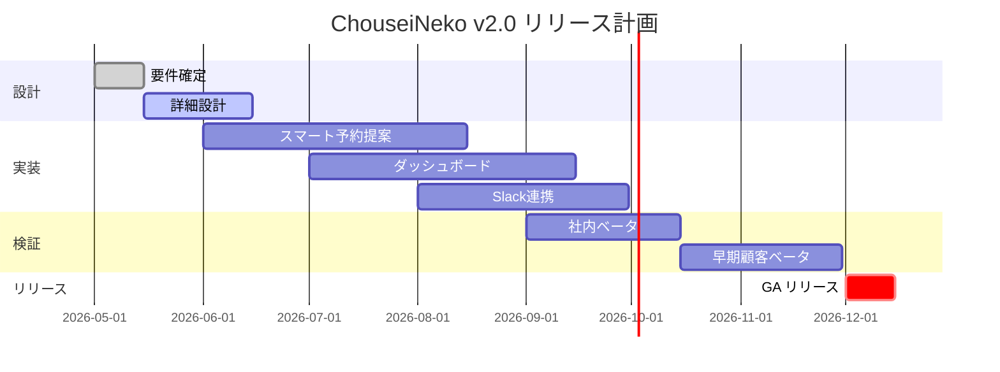

# プロダクト要件定義書（PRD）

## ChouseiNeko v2.0「スマート予約」機能

| 項目 | 内容 |
|---|---|
| ドキュメント番号 | PRD-CN-2026-005 |
| バージョン | 2.0 |
| 作成者 | プロダクト本部 山田 太郎 |
| レビュアー | 田中（エンジニアリング）、佐藤（デザイン）、鈴木（営業） |
| ステータス | レビュー中（Draft） |
| 最終更新 | 2026年5月6日 |
| 関連ドキュメント | [DD-CN-2026-008（詳細設計書）](./design.pdf) |

---

## 変更履歴

| バージョン | 日付 | 変更者 | 主な変更点 |
|---|---|---|---|
| 0.1 | 2026-04-12 | 山田 | 初版ドラフト作成 |
| 0.5 | 2026-04-25 | 山田 | ユーザーインタビュー結果を反映 |
| 1.0 | 2026-05-01 | 山田 | エンジニアリングレビュー実施版 |
| **2.0** | **2026-05-06** | **山田** | **スコープ確定、KPI再設定** |

---

## 1. エグゼクティブサマリー

本ドキュメントは、会議室・備品予約管理SaaS「**ChouseiNeko**」のバージョン2.0
において追加する「スマート予約」機能の要件を定義するものです。

現行の v1 系では「予約はできるが、最適な会議室を選ぶのが難しい」という課題が
ユーザー調査から明らかになりました。v2.0 では、参加者の人数・利用目的・
過去の利用履歴をもとに、最適な会議室を自動で提案する機能を提供します。

**期待される効果**

- 予約完了までの時間を **平均45秒 → 15秒**（約66%短縮）に短縮します
- 会議室の利用効率を **62% → 78%** に改善します
- 解約率を **月次2.4% → 1.5% 以下**に抑えます

---

## 2. 背景と課題

### 2.1 現状の利用状況

ChouseiNeko は 2024年10月にローンチし、2026年5月時点で
**有料契約 312社・約 18,400 アクティブユーザー** に利用されています。

| 指標 | 2025年5月 | 2026年5月 | 前年比 |
|---|---|---|---|
| 契約社数 | 187社 | 312社 | +66.8% |
| MAU | 9,600 | 18,400 | +91.7% |
| 月間予約数 | 約 12万件 | 約 28万件 | +133.3% |
| NPS | 21 | 18 | -3pt |

ユーザー数は順調に伸びている一方で、**NPS が低下**しており、
このままでは大型契約の更新リスクが高まると判断しています。

### 2.2 ユーザーが直面している課題

カスタマーサクセスチームによる過去6か月の問い合わせログと、
2026年4月に実施したユーザーインタビュー（n=18）から、以下の課題が
浮き彫りになりました。

#### 課題1: 「結局どの会議室が空いているか分からない」

> 「9時半から1時間、4人で打ち合わせがしたいんですが、空いている会議室を
> 探すのに毎回スクロールして比較してます。プロジェクター付きの中会議室が
> どれかも覚えていなくて……」
>
> — A社・営業部・30代女性（インタビュー #03）

#### 課題2: 「機能が多すぎて、目的の操作にたどり着けない」

> 「うちの新人さんに使い方を教える時、いつもまずカレンダー画面で迷うんです。
> 予約したいだけなのに、どこから始めればいいか分からないらしくて。」
>
> — B社・総務担当・40代男性（インタビュー #07）

#### 課題3: 「予定を入れた後の変更が面倒」

> 「参加者が一人増えると、それに合わせて広い部屋に取り直す必要があって。
> でも、空いている部屋を探し直すのが大変なので、結局そのままの部屋で
> ちょっと窮屈に会議してます。」
>
> — C社・エンジニア・20代男性（インタビュー #12）

### 2.3 ビジネスインパクト

これらの課題を放置した場合、以下のリスクがあります。

- **解約率の上昇**: 解約理由の上位3つに「使いにくさ」が入っており、
  今期の解約率は前期比 +0.6pt と悪化傾向です。
- **競合への流出**: 国内競合A社が同様の自動提案機能をリリース予定との
  情報があり、機能差で見劣りすると新規受注が鈍化する見込みです。
- **大型顧客の更新リスク**: 100名以上の大型契約3社で、運用負荷を理由とした
  解約検討の声が上がっています（営業ヒアリングより）。

---

## 3. ターゲットユーザー

### 3.1 主要ペルソナ

| ペルソナ | 利用シーン | 主な課題 | v2.0 で得たい価値 |
|---|---|---|---|
| 営業 田中さん（30代） | 顧客との打合せ前に急いで予約 | 空き会議室を素早く知りたい | 1タップで最適な部屋が決まる |
| 総務 佐藤さん（40代） | 全社会議の調整、新人サポート | 操作が複雑で説明が大変 | 誰でも迷わず使える |
| エンジニア 鈴木さん（20代） | チーム朝会、急な打合せ追加 | 予定変更時の手間 | 人数が変わっても自動で再提案 |

### 3.2 ユーザーストーリー

主要なユーザーストーリーは以下のとおりです。

- **US-01**: 営業として、参加人数を入力するだけで最適な会議室が提案されたい。
  なぜなら、商談前の限られた時間で意思決定したいから。
- **US-02**: 総務として、利用頻度の低い会議室を可視化したい。
  なぜなら、稼働率の低い会議室を集約・転用する判断材料にしたいから。
- **US-03**: エンジニアとして、参加者を追加した際に、より広い会議室を
  自動で再提案されたい。なぜなら、自分で空き状況を再調査する手間を
  省きたいから。

---

## 4. 提案する解決策

### 4.1 コアコンセプト

> **「予約する」ではなく、「予約が決まる」体験へ。**

ユーザーが「いつ・誰と・何のために」会議をしたいかを伝えるだけで、
ChouseiNeko が最適な会議室と時間帯を提案し、ワンタップで確定できる
体験を提供します。

### 4.2 ユーザーフロー（v1 → v2.0）



v1 系では7ステップ必要だった操作が、v2.0 では3ステップに短縮されます。

### 4.3 主要機能の概要

v2.0 で提供する主要機能は以下の3つです。

1. **スマート予約提案**: AI がユーザーの入力に基づき、最適な会議室と時間帯
   の候補を3件まで提示します。
2. **利用率ダッシュボード**: 総務担当者向けに、会議室ごとの稼働率や
   ピーク時間帯を可視化します。
3. **Slack連携**: 予約確定・変更・キャンセルを Slack の指定チャンネルに
   自動通知します。

---

## 5. スコープ

### 5.1 含むもの（MUST）

v2.0 で必ず実装する項目です。

- スマート予約提案機能（参加人数・希望時間・利用目的を入力 → 候補3件提示）
- 既存の予約画面からの導線
- 利用率ダッシュボード（管理者ロールのみアクセス可能）
- Slack連携（インバウンドWebhook、Bot形式の2通り）

### 5.2 含むもの（SHOULD）

可能な範囲で v2.0 に含めたい項目です。

- 会議目的のテキストから「必要な備品」を推定する機能
  （例:「プレゼン」→ プロジェクターありの会議室を優先）
- 過去30日分の予約履歴に基づく学習

### 5.3 含むもの（COULD）

時間と工数に余裕があれば実装する項目です。

- カレンダーアプリ（Google / Outlook）への双方向同期
- 多言語対応（英語）

### 5.4 含まないもの（v2.0 ではやらない）

以下の項目は v2.0 では対応しません。

- ❌ 外部の予約サービス（TimeRex 等）との連携
- ❌ Web会議URLの自動発行（Zoom / Google Meet）
- ❌ モバイルアプリのリニューアル（v2.1 で別途検討）

---

## 6. 機能詳細

### 6.1 スマート予約提案

#### なぜ作るのか

3.2 節のユーザーストーリー US-01 を満たすためです。営業や急ぎの打合せ
ユーザーが、空き会議室を**探す**作業から解放されることで、本来の業務に
集中できるようにします。

#### 動作概要

ユーザーが「人数・希望時間帯・利用目的（任意）」を入力すると、
バックエンドAPIが以下の優先順位で候補を提案します。

1. 希望時間帯にちょうど空いている会議室
2. 希望時間帯の前後30分以内で空いている会議室
3. 過去30日のユーザーの予約履歴で頻度の高い会議室

#### API設計（抜粋）

リクエスト例:

```json
{
  "attendee_count": 4,
  "preferred_start": "2026-05-10T09:30:00+09:00",
  "duration_minutes": 60,
  "purpose": "顧客との打ち合わせ"
}
```

レスポンス例:

```json
{
  "suggestions": [
    {
      "room_id": "room-7f3",
      "room_name": "会議室3F-東",
      "capacity": 6,
      "start": "2026-05-10T09:30:00+09:00",
      "end":   "2026-05-10T10:30:00+09:00",
      "score": 0.92,
      "reasons": ["希望時間にぴったり空いている", "プロジェクターあり"]
    }
  ]
}
```

#### 成功指標

- 提案された候補から予約が確定する率（**コンバージョン率 ≥ 70%**）
- 1回の予約完了までのクリック数（**平均 3 クリック以内**）

### 6.2 利用率ダッシュボード

#### なぜ作るのか

3.2 節の課題と、ペルソナ「総務 佐藤さん」のニーズに応えるためです。
会議室の稼働率を可視化することで、利用が少ない会議室の集約・転用判断を
支援し、契約継続のメリットを実感してもらいます。

#### 主な表示項目

- 会議室ごとの月次・週次稼働率（％）
- 時間帯別ヒートマップ（曜日 × 時間）
- 上位／下位5室のランキング
- 備品（プロジェクター・ホワイトボード等）の利用回数

> **田中（エンジニアリング）からのコメント**:
> 集計クエリが重くなりすぎないよう、日次でバッチ集計した結果を
> 専用テーブルに保存する方針で進めます。リアルタイム性は分単位ではなく
> 「前日まで」を基本とします。

### 6.3 Slack連携

#### なぜ作るのか

エンジニアチーム・カスタマーサクセスチームの双方から「予約状況をチームの
チャンネルで把握したい」という要望が複数件寄せられています。

#### 通知タイミング

- 予約が確定した時
- 予約が変更された時（時間・会議室・参加者）
- 予約がキャンセルされた時
- 開始10分前のリマインド（オプション）

通知形式はメッセージカード形式で、Slack 上から直接「予約を変更」
「キャンセル」のアクションが取れるようにします。

---

## 7. 成功指標（KPI）

### 7.1 北極星指標

**月間アクティブな予約完了数**を北極星指標とします。
現状の 28 万件 → リリース3か月後に **40 万件** を目標とします。

### 7.2 補助指標

| 指標 | 現状（v1） | 目標（v2.0） | 計測方法 |
|---|---|---|---|
| 予約完了までの平均時間 | 45秒 | 15秒以下 | フロントエンドのイベント計測 |
| 会議室稼働率 | 62% | 78% | 週次バッチで集計 |
| 月次解約率 | 2.4% | 1.5%以下 | 契約管理データ |
| NPS | 18 | 30以上 | 四半期アンケート |
| スマート予約提案からの確定率 | — | 70%以上 | 機能ログ |

---

## 8. リリース計画

### 8.1 フェーズ分割

リリースは段階的に行い、各フェーズで指標を確認しながら進めます。



### 8.2 マイルストーン

- 2026年6月15日: 詳細設計レビュー完了
- 2026年9月30日: 機能実装完了、社内ベータ開始
- 2026年10月15日: 早期顧客（10社）ベータ開始
- 2026年12月1日: GA（一般公開）リリース

---

## 9. 開かれた論点（Open Questions）

リリース前に決定が必要な論点を以下にまとめます。

> **Q1（佐藤・デザイン）**: スマート予約提案で「候補3件」を表示する際、
> 順序は固定でよいか、それともユーザーの過去の傾向に応じて並び替えるか？
>
> 検討状況: 並び替えるとスコアの説明責任が複雑になるため、初期リリースでは
> 固定順を採用する方向で合意済み。次フェーズで再検討。

> **Q2（鈴木・営業）**: ダッシュボードは管理者ロールのみで本当によいか？
> 「うちでは部署マネージャーにも見せたい」との要望を3社から受けている。
>
> 検討状況: ロール拡張機能（v2.1 候補）として独立スコープで検討予定。

> **Q3（田中・エンジニアリング）**: Slack 連携の通知量が多くなりすぎる
> 場合、ユーザーが受信種別を選択できる設定UI を v2.0 に含めるか？
>
> 検討状況: 通知種別ごとの ON/OFF 設定は v2.0 のスコープに含める方向。
> ただし詳細フィルタ（例: 特定の会議室のみ）は v2.1 以降。

---

## 10. 関連ドキュメント

- 詳細設計書: `DD-CN-2026-008`
- ユーザーインタビュー結果（生データ）: `RES-CN-2026-014`
- 競合調査レポート: `RES-CN-2026-011`
- アーキテクチャ概観: `ARCH-CN-2024-001`

---

## 付録. 用語集

| 用語 | 意味 |
|---|---|
| MAU | Monthly Active Users（月間アクティブユーザー数） |
| NPS | Net Promoter Score（顧客推奨度） |
| 北極星指標 | プロダクトの成功を最も端的に表す単一指標 |
| GA | General Availability（一般公開リリース） |
| MVP | Minimum Viable Product（最小限の価値を持つ製品） |

---

*本ドキュメントは md2pdf のサンプル集の一部です。完全に日本語で書かれた
プロダクト要件定義書（PRD）として、見出し階層・表・コードブロック・
Mermaid フローチャート・Mermaid ガントチャート・引用・箇条書きを含み、
日本語フォント（Noto Sans CJK JP）の表示品質を確認できます。*
